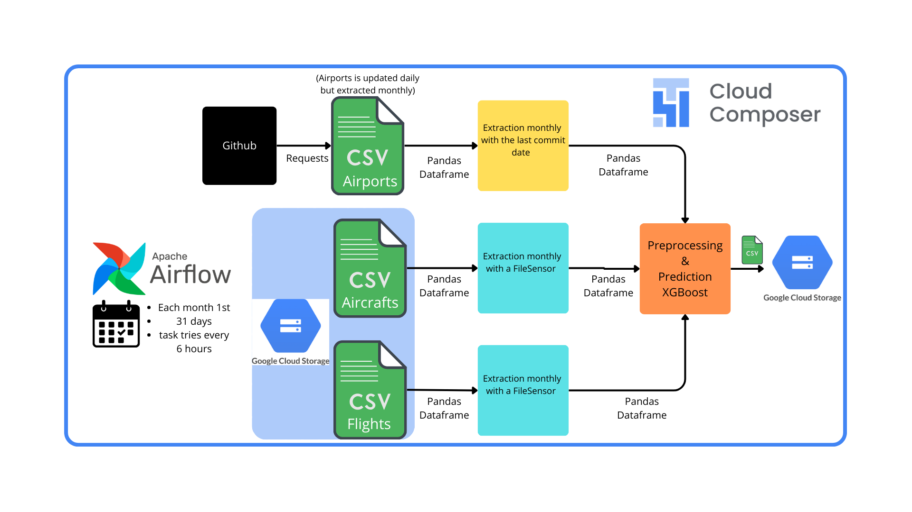

# Contrail Impact Prediction – Estuaire 

## Project Objective

This project was developed as part of the **Estuaire Aerospace Data Scientist/Engineer Challenge**. The main goals are:

- **Predict the contrail emission** (condensation trails) of flights using operational flight parameters and machine Learning model.
- **Automate monthly inference** by designing and deploying a production-ready data pipeline using 3 differents data sources updated monthly but at different dates.

Those contrails are problematic as around 3% of flights are responsible for 80% of the total contrail-induced climate impact. This makes standard regression approaches particularly challenging.

## Project Assumptions

### Sources of data
- Input data consists of **three CSV files**, each from a **different source**:
  - Aircraft data : a unique file which is monthly agregated by new data
  - Flight data : a monthly file which contains all the flights of a month
  - Airport data : also a unique file  monthly agregated and obtained from [ourairports.com database](https://ourairports.com/data/)
- This choice has been made after noticing that quite all of airplanes data is available as csv online or as API which were not for free
- This choice has also been motivated by the fact that quite all of the data sources can be turned into csv files which makes the architecture scalable 

### Monthly inference 
To infer data from three differents souurces, it has been decided to schedule each inference pipeline with Airflow. 
The pipeline is parametred to be ran monthly with 31 days of delay for the entiere DAG. 
Each failed task is rescheduled 6 hours after in order to do not use to much memory while being pretty reactive.
This allow the pipeline to treat differents updating dates while being adapted to all month length.

Due to training data, the model **only applies to commercial flights**.

## Running locally 
To run locally airflow, just run the Makefile command : `make run_local_airflow` and **rename the `defaut.env` file as `.env`**.
In order to run the pipeline, some mock files have been added.

## Tech Stack

### Visual Overview

### Orchestration & Scheduling
- **Apache Airflow** – for DAG definition and task orchestration
- **Google Cloud Composer** – managed Airflow deployment

### Data Processing & Inference
- **Pandas** – for data manipulation and preprocessing
- **Scikit-learn** – for model training and prediction

### Cloud & Storage
- **Google Cloud Bucket Storage (GCS)** – to store input/output CSVs

### Development & Reproducibility
- **Docker** – for local Airflow development and portability
- **Makefile** – for simplified commands 

### Data Sources
- **[OurAirports database](https://ourairports.com/data/)** – for airport metadata
- **data-challenge.csv** for model training

## Machine Learning Model

The model is trained to predict the **contrail impact in CO2-equivalent**. The model selected is XGBoost, more informations are available on the associate Notebook.

## Ways of improvement

This project is obviously not perfect, here are some points that may be interesting to develop with more time:
- Adding some BigQuery **intermediate tables** in the pipeline. In order to see the data, train the model on variables that have not been encoded yet or simply to ensure the pipeline is not a black box.
- Improve model accuracy using weather data which contributes a lot to maintaining contrails in the air.

This project can be for example used for **eco-optimization of flight plans** as aircraft companies are paying taxes for their emissions.
